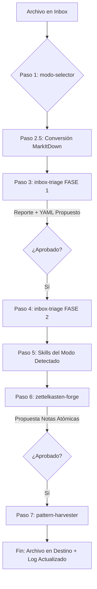

Imagina que tienes una gran biblioteca personal donde guardas todo tu trabajo, tus estudios y tus escritos, pero en lugar de ser solo un archivero estático, es una biblioteca viva que interactúa contigo. Está dividida en dos roles principales:
Tu Archivo Central (El Segundo Cerebro): Es donde guardas toda tu investigación, tus libros como "Orígenes", tus clases, tus sermones para la iglesia y tus trabajos de la maestría. Aquí cada idea está conectada con otras, como un gran mapa de tus pensamientos.
Tu Asistente Editorial (El Coach de Escritura): Es un asistente inteligente que se ha leído absolutamente todo lo que tú has escrito. Su regla de oro es que nunca escribe por ti, sino que funciona como un editor o mentor muy exigente. Él conoce tu estilo, sabe cómo te gusta explicar las cosas y conoce los límites de tu teología.


¿Cómo es el proceso cuando quieres guardar algo nuevo?
Todo lo que escribes (ya sea un capítulo de un libro, un ensayo para la escuela o los apuntes de una clase) pasa por un proceso de revisión muy ordenado. Piénsalo como una fábrica donde tú eres el director y debes aprobar (dar el "OK") en cada paso del ensamble:
Recepción y Diagnóstico: El asistente recibe tu nuevo texto, lo lee y te dice: "Ah, veo que este es un ensayo para la universidad", o "Esto es el borrador de tu nuevo libro". Te pregunta: "¿Es correcto?". Si le dices que sí, avanza.
Edición y Estructura: Dependiendo de lo que estés escribiendo, el asistente saca diferentes herramientas.
Si es material para la iglesia, verifica que mantengas un tono cercano, pastoral y esperanzador (tiene una lista de 10 puntos que debe cumplir).
Si es para tu maestría, "apaga" su lado pastoral y se vuelve estricto, revisando que el formato sea académico y neutral.
Si nota que te falta explicar mejor una idea, te lo señala para que tú lo corrijas.
Destilación de Ideas (Extracción de las pepitas de oro): Una vez que el texto está pulido, el asistente no solo lo guarda en la carpeta correspondiente, sino que saca las ideas más importantes y las convierte en "tarjetas de ideas" independientes. Así, si en tres años necesitas hablar sobre "El Bautismo", tendrás a la mano todas las ideas clave que escribiste hoy sobre ese tema.
Aprendizaje Final: Al terminar todo el proceso, el asistente analiza cómo escribiste hoy y te dice: "Noté que últimamente te gusta usar esta nueva estructura para explicar tus puntos. ¿Quieres que me aprenda ese estilo para evaluar tus futuros escritos?". Tú le das el OK y el asistente se vuelve un poco más inteligente y más parecido a ti para la próxima vez.

---

# MiLibreriaMaestra — Documento Ejecutivo del Sistema

**Autor:** Daniel Lira Serhan  
**Versión:** `v3.0`  
**Fecha:** 28 de abril de 2026  
**Repositorio:** `danielliraserhan-rgb/MiLibreriaMaestra`

---

## 1. Introducción
**MiLibreriaMaestra** es un sistema de gestión de conocimiento teológico construido sobre **Obsidian** y potenciado por **Claude Code**. Su propósito es procesar, catalogar y conectar el material pastoral y académico de Daniel Lira: libros, predicaciones, clases, papers y notas.

### La Dualidad del Sistema
El sistema opera bajo una filosofía **Zettelkasten** (notas atómicas interconectadas) y está gobernado por dos identidades:

* **S1 - Segundo Cerebro (Obsidian):** El almacén. Donde viven los archivos, MOCs (Mapas de Contenido) y la base de datos de conocimiento.
* **S2 - Coach de Escritura (Claude Code):** La inteligencia. Analiza, diagnostica y entrena. Claude observa; Daniel decide.

---

## 2. Arquitectura del Vault
La estructura se divide por dominios con reglas hermenéuticas y editoriales distintas:

| Dominio | Temas | Enfoque | Voz |
| :--- | :--- | :--- | :--- |
| **Pastoral** | 01-07 | Orígenes, Historia, Escatología, Exégesis, Doctrinas, Discipulado, Predicaciones. | Cristocéntrica, pastoral, narrativa. |
| **Académico** | 08 | Maestría en Biola University. | Neutral, formal, citación técnica. |

### Carpetas de Sistema Críticas
* `Inbox/`: Punto de entrada (incluye sincronización con Scrivener).
* `_Skills/`: Scripts de Python, lógica de patrones (`activePatterns.json`) y bitácoras de proceso.
* `09_Zettelkasten/`: El núcleo atómico del sistema.
* `ContextoMaestro/`: El "ADN" del sistema (reglas de voz y líneas rojas teológicas).

---

## 3. Flujo de Entrada (El Trayecto)
El flujo es estrictamente lineal y secuencial. **Regla de Oro:** Nunca se avanza sin el `OK` explícito del autor.

---

## 4. Los 8 Modos de Procesamiento
Cada archivo entrante activa un pipeline específico según su naturaleza:

| Modo | Tipo | Pipeline de Skills | Objetivo ZK |
| :--- | :--- | :--- | :--- |
| **1** | Libro Terminado | `triage` → `modo-c` → `forge` → `harvester` | 15-30 notas |
| **2** | Libro Pre-Diseño | `triage` → `modo-c` → `modo-ab` → `modo-r` → `forge` | 10-25 notas |
| **3** | Ideas Sueltas | `triage` → `forge` → `harvester` | 5-10 notas |
| **4** | Guía de Estudio | `triage` → `modo-e` (bíblica) → `forge` | 10-20 notas |
| **8** | Académico | `triage` → `notas-maestria` → `forge` → `harvester` | 5-15 notas |

---

## 5. Catálogo de Skills (Capacidades del Sistema)

### 5.1 Flujo Principal
* **`inbox-triage`**: Clasifica el archivo, asigna el modo y genera metadatos YAML v2.
* **`modo-ab` (Coach Anotador)**: Separa transcripciones orales de borradores escritos para identificar redundancias.
* **`zettelkasten-forge`**: Genera notas atómicas con campos **SM-2** para repetición espaciada.
* **`pattern-harvester`**: Extrae patrones de voz y teología para alimentar la IA.

### 5.2 Skills de Soporte y Autónomos
* **`spaced-review` (SM-2)**: Algoritmo de aprendizaje para revisar notas vencidas diariamente.
* **`desarrollador-de-temas`**: Escáner de "huecos" que detecta preguntas abiertas o temas sin contenido.
* **`conversion-documentos`**: Integración con `markitdown` para transformar PDFs y DOCX a Markdown.

---

## 6. Infraestructura Técnica

### Stack Tecnológico
* **Motor:** Claude Code (terminal) & Obsidian (UI).
* **Lógica:** Python 3.x (scripts de automatización y SM-2).
* **Control de Versiones:** Git con flujo de Pull Requests para cada sesión de edición.
* **Algoritmo de Memoria:** SM-2 (SuperMemo 2).

> [!CAUTION]
> **Gestión de Worktrees (Git):** > Claude Code opera en ramas aisladas. Para evitar desincronización, ejecutar siempre tras cerrar sesión:
> `git fetch --all && git reset --hard origin/main && git clean -fd`

---

## 7. Estado del Sistema (al 28 de abril de 2026)

* **Notas Zettelkasten Totales:** 330
* **Patrones de Voz Activos:** 5 (v1.1)
* **Última Mejora:** Implementación del "Gap Detector" (PR #9) para identificar temas huerfanos.

### Reglas Editoriales No Negociables
1.  **Cristocentrismo:** En el dominio pastoral, todo apunta a Cristo.
2.  **Identidad antes que conducta:** La teología precede a la ética.
3.  **Preservación Oral:** En transcripciones, no se elimina nada; solo se da estructura.
4.  **Régimen Académico:** Neutralidad total en el Tema 08 (Biola).

---
**Daniel Lira Serhan** | *MiLibreriaMaestra v3.0*
